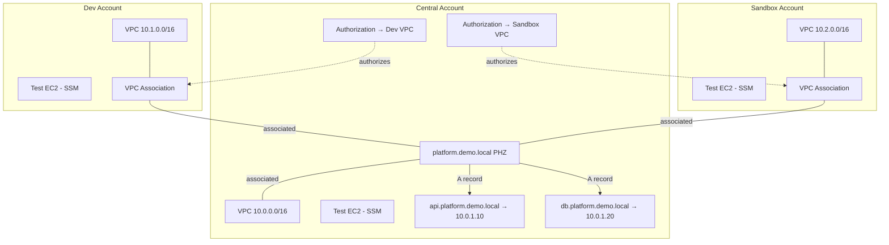

# Design Document

## Overview

This design describes a Terraform demo that implements the **classic Route 53 cross-account private DNS sharing pattern** using VPC association authorization. The architecture spans three AWS accounts (central, dev, sandbox), each with a minimal VPC and one test EC2 instance.

The demo proves that workloads in any associated VPC resolve DNS records from a single authoritative private hosted zone owned by the central account — without Route 53 Profiles, AWS RAM, Transit Gateway, or orchestration scripts.

### Design Goals

- Demonstrate the native `CreateVPCAssociationAuthorization` / `AssociateVPCWithHostedZone` pattern
- Keep infrastructure minimal: one VPC per account, one PHZ, one EC2 per account
- Support manual phased deployment suitable for live walkthroughs
- Verify DNS with EC2 + SSM Session Manager + `dig` — no test harness or verification scripts
- Keep modules reusable and composable via standard Terraform input/output contracts

### Architecture Diagram



## Architecture

### Account and stack layout (multi-region)

| Stack | Account | Region | CIDR | Role |
|-------|---------|--------|------|------|
| `network` | network | ap-southeast-2 | 10.0.0.0/16 + 10.3.0.0/16 | PHZ owner, authorizations, dual VPC |
| `network-apse6` | network | ap-southeast-6 | 10.10.0.0/16 | Same-account cross-region association |
| `dev-apse2` | dev | ap-southeast-2 | 10.1.0.0/16 | Cross-account same-region |
| `dev-apse6` | dev | ap-southeast-6 | 10.11.0.0/16 | Cross-account cross-region |
| `sandbox-apse2` | sandbox | ap-southeast-2 | 10.2.0.0/16 | Cross-account same-region |
| `sandbox-apse6` | sandbox | ap-southeast-6 | 10.12.0.0/16 | Cross-account cross-region |

### Deployment phases

1. **Phase 1** — all six stacks, VPCs only (flags disable PHZ/associations/EC2)
2. **Phase 2a** — `network`: PHZ, secondary VPC association, four cross-account authorizations
3. **Phase 2b** — `network-apse6`: same-account cross-region association
4. **Phase 3** — workload stacks: cross-account associations + EC2

#### Phase Gating via Feature Flags

Dev and sandbox account roots use boolean flags to gate Phase 1 vs Phase 3 without maintaining separate stacks:

```hcl
variable "enable_zone_association" {
  type        = bool
  default     = true
  description = "Set false for Phase 1 (VPC only)"
}

variable "enable_test_ec2" {
  type        = bool
  default     = true
  description = "Set false for Phase 1 (VPC only)"
}
```

Resources that depend on the central PHZ (`aws_route53_zone_association`, `module.test_ec2`) are created only when the corresponding flag is `true`. Phase 1 applies with both flags set to `false`.

The central account deploys in a single Phase 2 apply — no gating flags needed there.

### Presenter Walkthrough

`docs/walkthrough.md` is the single operator guide. It covers:

| Section | Content |
|---------|---------|
| Prerequisites | AWS accounts, deploy roles, `terraform.tfvars` setup |
| Phase 1 | `terraform apply` in dev/sandbox with flags disabled; capture `vpc_id` |
| Phase 2 | `terraform apply` in central with VPC IDs; capture `zone_id` |
| Phase 3 | `terraform apply` in dev/sandbox with flags enabled and `zone_id` set |
| DNS testing | SSM into each Test EC2; run `dig api.platform.demo.local` |
| Teardown | Reverse-order `terraform destroy` across all roots |

#### DNS Testing Flow

Testing is the demo payoff — kept deliberately simple:

1. Open SSM Session Manager on the dev Test EC2:
   ```bash
   aws ssm start-session --target <dev-instance-id>
   ```
2. Run a lookup from inside the VPC:
   ```bash
   dig +short api.platform.demo.local
   # expected: 10.0.1.10
   ```
3. Repeat from sandbox and central Test EC2 instances to show all three VPCs resolve the same central PHZ record.

Optional: `dig +short db.platform.demo.local` → `10.0.1.20`.

No verification scripts, SSM send-command automation, or CI jobs — the presenter runs these commands live.

### Provider Strategy

Each account root splits provider configuration across two files:

- **`versions.tf`** — `required_version` (>= 1.5.0) and `required_providers`
- **`providers.tf`** — AWS provider with `region` and `default_tags`

Authentication uses the **default AWS credential chain** — set `AWS_PROFILE` to the target account before each phased apply:

```hcl
provider "aws" {
  region = var.aws_region

  default_tags {
    tags = {
      Project   = var.project_name
      Account   = var.account_name
      ManagedBy = "terraform"
    }
  }
}
```

Default tags (`Project`, `Account`, `ManagedBy`) are applied to all taggable resources. Resource-level tags (e.g. `Name`) are kept and override on key collision.

Example profiles: `r53demo-central`, `r53demo-dev`, `r53demo-sandbox` (configured in `~/.aws/config`).

Before each phase:

```bash
export AWS_PROFILE=r53demo-dev
aws sts get-caller-identity
cd terraform/accounts/dev/
terraform apply ...
```

### Directory Structure

```
terraform/
├── accounts/
│   ├── central/
│   │   ├── main.tf
│   │   ├── variables.tf
│   │   ├── outputs.tf
│   │   ├── versions.tf
│   │   ├── providers.tf
│   │   └── terraform.tfvars.example
│   ├── dev/
│   │   ├── main.tf
│   │   ├── variables.tf
│   │   ├── outputs.tf
│   │   ├── versions.tf
│   │   ├── providers.tf
│   │   └── terraform.tfvars.example
│   └── sandbox/
│       ├── main.tf
│       ├── variables.tf
│       ├── outputs.tf
│       ├── versions.tf
│       ├── providers.tf
│       └── terraform.tfvars.example
└── modules/
    ├── vpc/
    ├── private-hosted-zone/
    ├── cross-account-auth/
    └── test-ec2/
docs/
└── walkthrough.md
```

No `scripts/` directory — apply, test, and destroy are manual steps in the walkthrough.

## Components and Interfaces

### Module: `vpc`

**Purpose:** Create a minimal DNS-ready VPC with private subnets and SSM endpoints.

**Inputs:**

| Variable | Type | Description |
|----------|------|-------------|
| `name_prefix` | string | Naming prefix for all resources |
| `cidr_block` | string | VPC CIDR (e.g., `10.0.0.0/16`) |
| `aws_region` | string | Region for AZ selection |

**Outputs:**

| Output | Type | Description |
|--------|------|-------------|
| `vpc_id` | string | VPC identifier |
| `private_subnet_ids` | list(string) | IDs of the two private subnets |

**Resources created:**
- `aws_vpc` — DNS support and DNS hostnames enabled
- `aws_subnet` (×2) — private subnets in two AZs
- `aws_vpc_endpoint` (×3) — `com.amazonaws.{region}.ssm`, `.ssmmessages`, `.ec2messages`
- `aws_security_group` — allows HTTPS inbound for VPC endpoints
- `aws_route_table` + associations

**Design decisions:**
- Two subnets provide AZ resilience while keeping the demo simple.
- No NAT Gateway or Internet Gateway — all traffic stays private. SSM connectivity uses VPC endpoints.
- VPC endpoints share a single security group allowing HTTPS (443) from the VPC CIDR.

---

### Module: `private-hosted-zone`

**Purpose:** Create the platform PHZ, associate it with the central VPC, and populate demo A records.

**Inputs:**

| Variable | Type | Description |
|----------|------|-------------|
| `zone_name` | string | FQDN for the zone (e.g., `platform.demo.local`) |
| `vpc_id` | string | Central VPC to associate |
| `records` | map(object) | Map of record name → { type, value } |

**Outputs:**

| Output | Type | Description |
|--------|------|-------------|
| `zone_id` | string | PHZ identifier |

**Resources created:**
- `aws_route53_zone` — private zone associated with the central VPC
- `aws_route53_record` — one per entry in `records` map

**Design decisions:**
- Records are passed as a map so the module stays generic; the account root defines the specific entries (`api` → `10.0.1.10`, `db` → `10.0.1.20`).
- The initial VPC association (central) is set in the `aws_route53_zone` resource's `vpc` block, which is required for private zones.

---

### Module: `cross-account-auth`

**Purpose:** Authorize external VPCs to associate with the central PHZ.

**Inputs:**

| Variable | Type | Description |
|----------|------|-------------|
| `zone_id` | string | The PHZ to authorize against |
| `authorized_vpcs` | map(object({ vpc_id = string, vpc_region = string })) | Per-VPC ID and region to authorize |

**Outputs:**

| Output | Type | Description |
|--------|------|-------------|
| `authorization_ids` | map(string) | Map of label → authorization resource ID |

**Resources created:**
- `aws_route53_vpc_association_authorization` — one per VPC in the map

**Design decisions:**
- Uses `for_each` on the `vpc_ids` map for clean labeling and independent lifecycle.
- No RAM shares, no Route 53 Profile resources — strictly native authorization API.

---

### Module: `test-ec2`

**Purpose:** Provision a single minimal EC2 instance with SSM access for live DNS testing from inside a VPC.

**Inputs:**

| Variable | Type | Description |
|----------|------|-------------|
| `name_prefix` | string | Naming prefix |
| `instance_type` | string | EC2 instance type (default: `t4g.nano`) |
| `subnet_id` | string | Private subnet to place the instance |
| `vpc_id` | string | VPC for security group |

**Outputs:**

| Output | Type | Description |
|--------|------|-------------|
| `instance_id` | string | EC2 instance ID (for SSM connect) |

**Resources created:**
- `aws_instance` — Amazon Linux 2023 ARM64 AMI, no public IP
- `aws_iam_role` + `aws_iam_instance_profile` — with `AmazonSSMManagedInstanceCore` policy
- `aws_security_group` — egress-only (HTTPS to VPC endpoints)

**Design decisions:**
- `t4g.nano` (ARM/Graviton) is the smallest general-purpose instance — minimal cost.
- No public IP, no SSH key pair — SSM Session Manager is the only access path.
- Uses the latest Amazon Linux 2023 ARM64 AMI via `aws_ssm_parameter` data source lookup.
- `bind-utils` (for `dig`) is available on Amazon Linux 2023 by default.

---

### Account Root: `central`

Composes modules:
1. `vpc` — central VPC (10.0.0.0/16)
2. `private-hosted-zone` — creates PHZ + records
3. `cross-account-auth` — authorizes dev/sandbox VPCs
4. `test-ec2` — DNS test instance

Takes dev/sandbox VPC IDs as input variables (provided after Phase 1).

**Key outputs:** `zone_id`, `vpc_id`, `test_ec2_instance_id`

---

### Account Root: `dev` / `sandbox`

Each composes:
1. `vpc` — account-specific VPC (10.1.0.0/16 or 10.2.0.0/16)
2. `aws_route53_zone_association` — associates local VPC with central PHZ (gated by `enable_zone_association`)
3. `test-ec2` — DNS test instance (gated by `enable_test_ec2`)

Takes `zone_id` as an input variable (provided after Phase 2).

**Design decision:** The VPC association is a single `aws_route53_zone_association` resource placed directly in the account root rather than in a module, because it's one resource with two inputs and wrapping it adds no value.

## Data Models

### Terraform Variable Schema (per account root)

**Common variables (all roots):**

```hcl
variable "aws_region" {
  type    = string
  default = "ap-southeast-2"
}

variable "project_name" {
  type    = string
  default = "r53demo"
}

variable "account_name" {
  type    = string
  default = "central" # dev or sandbox per account root
}

variable "instance_type" {
  type    = string
  default = "t4g.nano"
}
```

**Central-specific variables:**

```hcl
variable "demo_domain" {
  type    = string
  default = "demo.local"
}

variable "dev_vpc_id" {
  type        = string
  description = "Dev account VPC ID (from Phase 1 output)"
}

variable "sandbox_vpc_id" {
  type        = string
  description = "Sandbox account VPC ID (from Phase 1 output)"
}
```

**Dev/Sandbox-specific variables:**

```hcl
variable "zone_id" {
  type        = string
  description = "Central PHZ zone ID (from Phase 2 output)"
  default     = ""
}

variable "enable_zone_association" {
  type    = bool
  default = true
}

variable "enable_test_ec2" {
  type    = bool
  default = true
}
```

Account ID variables are not required — cross-account authorization uses VPC IDs only.

### State Isolation

Each account root maintains its own Terraform state. No remote state data sources are used — cross-account references are passed as variables between phases (captured from `terraform output` and provided via `terraform.tfvars` or `-var` flags).

### Resource Naming Convention

All resources use a consistent `name_prefix` pattern:

- Central: `r53demo-central-*`
- Dev: `r53demo-dev-*`
- Sandbox: `r53demo-sandbox-*`

## Correctness Properties

This feature is Infrastructure as Code (Terraform) — declarative resource configuration, not functions with inputs and outputs. Property-based testing with randomized inputs is not applicable because Terraform modules produce a resource graph, not computed outputs that vary meaningfully across a random input space.

The following **structural correctness properties** can be statically verified against the Terraform source:

### Property 1: Terraform validate passes in all account roots

*For all* account root directories (central, dev, sandbox), running `terraform validate` after `terraform init` SHALL return a successful result with no errors.

**Validates: Requirement 8**

### Property 2: No Route 53 Profiles or RAM resources exist

*For all* Terraform files across all modules and account roots, no `aws_route53profiles_*` or `aws_ram_*` resource types SHALL be present.

**Validates: Requirement 2.3**

### Property 3: All VPCs have DNS support and DNS hostnames enabled

*For all* `aws_vpc` resources in the VPC module, both `enable_dns_support` and `enable_dns_hostnames` SHALL be `true`.

**Validates: Requirement 4.1**

### Property 4: Each account root uses provider default tags

*For all* account root provider configurations, the AWS provider block SHALL set `region`, SHALL NOT include an `assume_role` block, and SHALL include a `default_tags` block with `Project`, `Account`, and `ManagedBy` tags. Authentication is external via `AWS_PROFILE`.

**Validates: Requirement 9**

### Property 5: Each account root declares Terraform version constraints

*For all* account root directories, a `versions.tf` file SHALL declare `required_version >= 1.5.0` and the AWS provider constraint.

**Validates: Requirement 8**

### Property 6: Cross-account authorization uses only native Route 53 resources

*For all* resources in the `cross-account-auth` module, only `aws_route53_vpc_association_authorization` SHALL be used — no RAM shares, no Route 53 Profiles.

**Validates: Requirement 2.2**

### Property 7: No orchestration or verification scripts exist

The repository SHALL NOT contain shell scripts for apply, destroy, or DNS verification automation.

**Validates: Requirements 5.7, 6, 7**

## Error Handling

### Deployment Errors

| Scenario | Cause | Resolution |
|----------|-------|------------|
| Phase 2 fails with "VPC not found" | VPC IDs from Phase 1 are incorrect or VPCs were destroyed | Re-run Phase 1, capture correct VPC IDs |
| Phase 3 fails with "authorization not found" | Phase 2 wasn't completed or authorizations were removed | Re-run Phase 2 |
| VPC association fails with "ConflictingDomainExists" | VPC is already associated with a zone of the same name | Remove existing association or use a different domain |
| EC2 instance unreachable via SSM | VPC endpoints not created or security group misconfigured | Verify VPC module deployed; check endpoint SG allows 443 from VPC CIDR |
| `dig` returns no answer | Association not active or PHZ records missing | Confirm Phase 3 completed; check Route 53 console for association status |

### Teardown Errors

| Scenario | Cause | Resolution |
|----------|-------|------------|
| Central destroy fails with "VPC association still active" | Workload accounts still associated | Destroy dev/sandbox first (documented in walkthrough) |
| Authorization delete fails | Association still using it | Destroy the association first |

### Pre-Apply Validation

The walkthrough documents running `terraform init` + `terraform validate` as a pre-flight check before each phase.

## Testing Strategy

### Why Property-Based Testing Does Not Apply

This feature is **Infrastructure as Code (Terraform)**. Acceptance criteria describe declarative resource provisioning, AWS API interactions, walkthrough documentation, and configuration correctness. None of these involve pure functions where universal properties can be asserted across randomized inputs.

### Testing Approach

**1. Static validation (pre-apply, manual):**
- `terraform fmt -check` — consistent formatting
- `terraform validate` — HCL syntax and provider schema correctness
- `terraform plan` — preview resource graph before applying

**2. Integration testing (post-apply, manual — the demo itself):**
- SSM Session Manager into each Test EC2
- `dig api.platform.demo.local` returns `10.0.1.10` from central, dev, and sandbox
- Optional: `dig db.platform.demo.local` returns `10.0.1.20`

**3. Documentation review:**
- Walkthrough covers all three apply phases and reverse teardown
- Walkthrough documents SSM connect and `dig` commands with expected output
- `terraform.tfvars.example` lists phase-specific variables

### Test Execution

Testing is entirely manual and presenter-driven:

1. Deploy via phased walkthrough (Phases 1 → 2 → 3)
2. Connect to each Test EC2: `aws ssm start-session --target <instance-id>`
3. Run `dig +short api.platform.demo.local` and confirm `10.0.1.10`
4. Tear down via documented reverse-order `terraform destroy` steps

No automated test harness, verification scripts, or CI pipelines.
