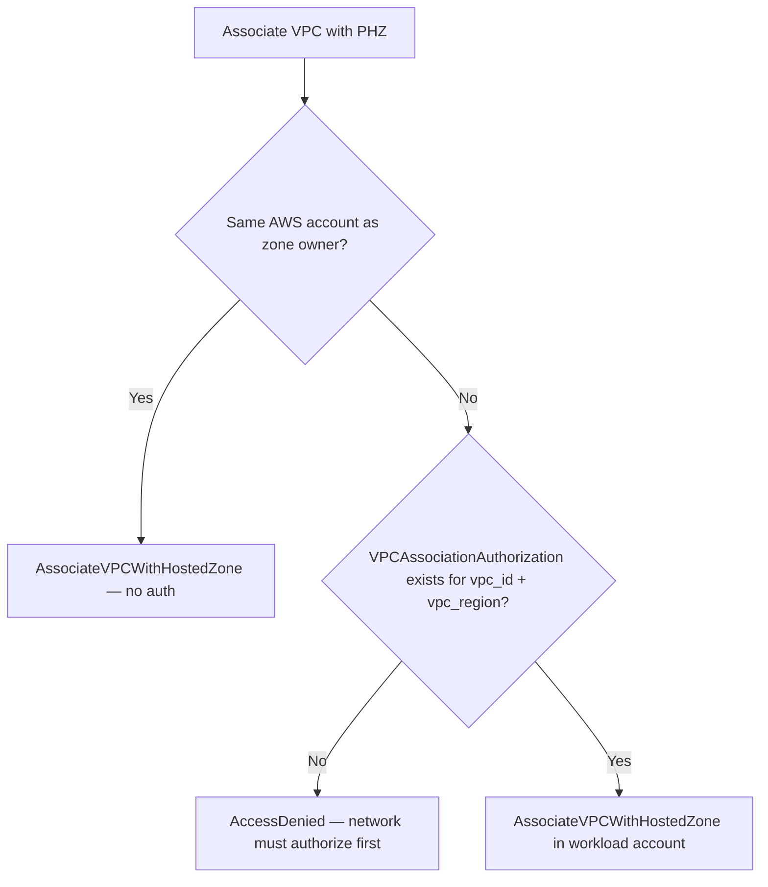
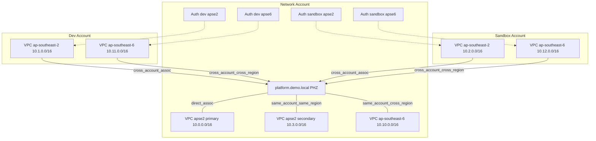
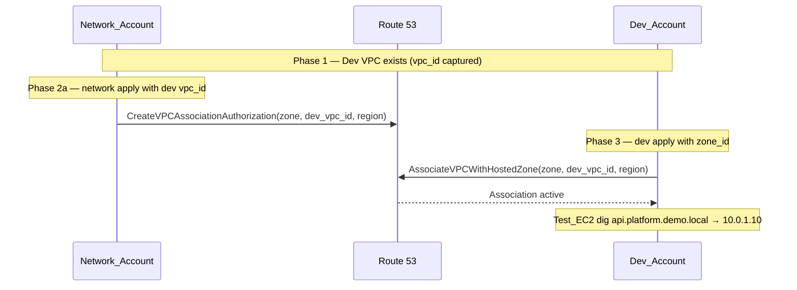
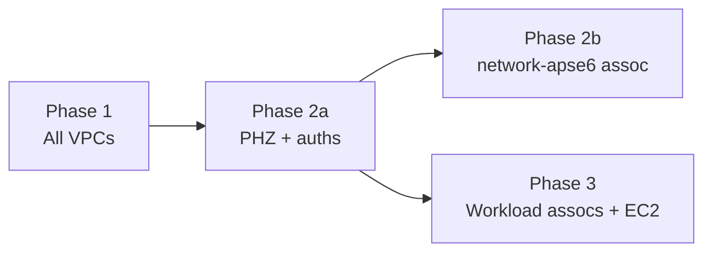

# Architecture — Classic Route 53 Multi-Account DNS

This document describes **what** the demo builds and **how** private DNS sharing works. For phased deploy commands, DNS test steps, and teardown, see [walkthrough.md](walkthrough.md).

## Pattern summary

One **Platform_Zone** (`platform.demo.local`) lives in the **Network_Account**. Every other VPC **associates** with that zone so workloads resolve the same records regardless of account or region.

Sharing uses the classic Route 53 APIs:

| API (concept) | Who calls it | Purpose |
|---------------|--------------|---------|
| `CreateVPCAssociationAuthorization` | Network_Account (zone owner) | Permit a specific VPC (id + region) to associate |
| `AssociateVPCWithHostedZone` | VPC-owning account | Link the VPC to the authorized PHZ |

No Route 53 Profiles, AWS RAM, Transit Gateway, or orchestration scripts.

```text
Network_Account                    Workload account (dev / sandbox)
─────────────────                  ────────────────────────────────
Platform_Zone                      VPC
     │                                 │
     ├── records (api, db)             │
     │                                 │
     └── VPCAssociationAuthorization ──┼──► AssociateVPCWithHostedZone
         (Phase 2a)                   │         (Phase 3)
```

## Why classic

**Classic** exposes authorizations and associations as separate, auditable steps — ideal for teaching the Route 53 sharing contract.

**Tradeoffs:** authorizations bind to exact `vpc_id` and `vpc_region`; VPC recreation requires re-authorization; network and workload teams apply changes in sequence; `vpc_id` and `zone_id` are passed manually between Terraform stacks.

**Alternatives not used here:** Route 53 Profiles and RAM-based sharing centralise lifecycle management but add different setup and ownership models.

## Accounts, regions, and stacks

Three AWS accounts, two regions, six Terraform stacks:

| Stack | Account | Region | VPC role | CIDR |
|-------|---------|--------|----------|------|
| `network` | network | ap-southeast-2 | PHZ owner; primary + secondary VPC | 10.0.0.0/16, 10.3.0.0/16 |
| `network-apse6` | network | ap-southeast-6 | Same-account cross-region VPC | 10.10.0.0/16 |
| `dev-apse2` | dev | ap-southeast-2 | Cross-account workload | 10.1.0.0/16 |
| `dev-apse6` | dev | ap-southeast-6 | Cross-account cross-region workload | 10.11.0.0/16 |
| `sandbox-apse2` | sandbox | ap-southeast-2 | Cross-account workload | 10.2.0.0/16 |
| `sandbox-apse6` | sandbox | ap-southeast-6 | Cross-account cross-region workload | 10.12.0.0/16 |

Each VPC gets one **Test_EC2** instance in a private subnet (seven instances total) for in-VPC DNS verification via SSM.

## Platform zone and records

All shared DNS records exist **only** in the Network_Account PHZ. Workload accounts resolve names; they do not create local copies.

| Record | Type | Value | Purpose |
|--------|------|-------|---------|
| `api.platform.demo.local` | A | 10.0.1.10 | Primary demo lookup |
| `db.platform.demo.local` | A | 10.0.1.20 | Optional second record |

Record targets are fictional private IPs in the network primary CIDR — they prove resolution, not reachability.

## Four association scenarios

The demo deliberately covers every combination Route 53 classic auth supports:

| # | Scenario | Example | Authorization required? | Who creates association |
|---|----------|---------|-------------------------|-------------------------|
| 1 | Cross-account, same region | `dev-apse2` | Yes | Dev_Account |
| 2 | Cross-account, cross-region | `dev-apse6` | Yes (`vpc_region = ap-southeast-6`) | Dev_Account |
| 3 | Same-account, cross-region | `network-apse6` | No | Network_Account |
| 4 | Same-account, same region (2nd VPC) | `network` secondary | No | Network_Account (with PHZ) |

Cross-account flows always require **two parties**: network authorizes in Phase 2a, workload associates in Phase 3. Same-account flows skip authorization.

## VPC association requirements

This section consolidates what Route 53 requires to associate a VPC with a private hosted zone, how security works in the classic authorization model, and production-minded best practices. Operational apply steps live in [walkthrough.md](walkthrough.md).

### When is authorization required?



Use the four-scenario table above for concrete examples. The flowchart answers the live demo question: *does this VPC need authorization first?*

### AWS prerequisites checklist

| Requirement | Cross-account | Same-account | Demo reference |
|-------------|---------------|--------------|----------------|
| PHZ exists (`zone_id` valid) | Yes | Yes | Phase 2a `zone_id` output |
| Target VPC exists | Yes | Yes | Phase 1 `vpc_id` per stack |
| `vpc_region` matches the VPC's AWS region | Yes | Yes | `cross-account-auth` module — apse2 vs apse6 |
| `VPCAssociationAuthorization` for exact `vpc_id` | Yes | No | Phase 2a — `network` stack |
| `AssociateVPCWithHostedZone` in VPC-owning account | Yes | Yes | Phase 2b (`network-apse6`) / Phase 3 (workloads) |
| VPC DNS support and DNS hostnames enabled | Yes | Yes | VPC module defaults |

Additional rules:

- **Authorization specificity** — each authorization binds to an exact `vpc_id` and `vpc_region`. If a workload VPC is destroyed and recreated, network must re-authorize the new ID before Phase 3 succeeds.
- **Propagation** — after a new association, allow **1–2 minutes** before expecting in-VPC `dig` to answer (cross-region associations may take longer).
- **Quotas** — AWS limits how many VPCs can associate with one private hosted zone. This demo uses seven associations — well within default quotas, but relevant when scaling beyond the walkthrough.

### Two-party operations (cross-account)

Cross-account sharing is an explicit two-step contract:

| Action | API | Who calls it | Demo phase |
|--------|-----|--------------|------------|
| Create authorization | `CreateVPCAssociationAuthorization` | Network_Account (zone owner) | 2a |
| Associate VPC | `AssociateVPCWithHostedZone` | VPC-owning account | 2b / 3 |
| Disassociate VPC | `DisassociateVPCFromHostedZone` | VPC-owning account | Teardown Step 1 |
| Delete authorization | `DeleteVPCAssociationAuthorization` | Network_Account | `network` destroy |
| Delete PHZ | `DeleteHostedZone` | Network_Account | Only after all cross-account associations removed |

Terraform resources in this demo:

- `aws_route53_vpc_association_authorization` — [`cross-account-auth` module](../terraform/modules/cross-account-auth/main.tf)
- `aws_route53_zone_association` — workload stacks and `network-apse6`
- `aws_route53_zone` + primary VPC block — [`private-hosted-zone` module](../terraform/modules/private-hosted-zone/main.tf)

Same-account associations (`network` secondary VPC, `network-apse6`) skip the authorization step — the zone owner calls `AssociateVPCWithHostedZone` directly.

### Security model

Classic VPC association affects the **DNS control plane only**. It is not network connectivity and not IAM cross-account access.

#### What association grants

- Associated VPCs can **resolve** records in the shared **Platform_Zone** via the VPC resolver (AmazonProvidedDNS at VPC CIDR + 2).
- **Network_Account** retains **exclusive control** of record sets — all `aws_route53_record` resources live in the `network` stack only.

#### What association does not grant

- **No network path** to record targets. Demo answers (`10.0.1.10`) prove DNS resolution, not reachability — `dig` succeeding does not mean traffic can route to that IP.
- **No IAM role trust** or resource access between accounts.
- Workload accounts **cannot** create, modify, or delete PHZ records unless principals also hold Route 53 permissions in the Network_Account.

#### Security properties of classic authorization

- **Explicit allow-list** — network authorizes specific VPC IDs; there is no account-wide "associate any VPC" permission.
- **Region-scoped** — `vpc_region` on the authorization must match the target VPC's region, preventing accidental cross-region mismatches.
- **Auditable two-step** — authorization and association are separate API calls, each logged in CloudTrail.
- **Revocable** — disassociate the VPC, then delete the authorization; resolution stops from that VPC immediately.

#### IAM permissions (reference — not implemented in demo)

This demo uses SSO `AdministratorAccess` per account. For production, scope IAM to least privilege. Typical actions:

| Account | Typical Route 53 actions |
|---------|--------------------------|
| Network (zone owner) | `CreateVPCAssociationAuthorization`, `DeleteVPCAssociationAuthorization`, `ChangeResourceRecordSets`, `GetHostedZone`, `ListHostedZones`, same-account `AssociateVPCWithHostedZone`, `DisassociateVPCFromHostedZone` |
| Workload (VPC owner) | `AssociateVPCWithHostedZone`, `DisassociateVPCFromHostedZone`, `GetHostedZone`, `ListHostedZonesByVPC` |

See [AWS Route 53 IAM documentation](https://docs.aws.amazon.com/Route53/latest/DeveloperGuide/access-control-managing-permissions.html) for exact policy syntax. This repository does not ship custom Route 53 IAM policies.

### Best practices

- **Single zone owner** — one **Platform_Zone** in Network_Account; workload accounts resolve shared names but do not create local PHZ copies.
- **Authorize before associate** — enforce Phase 2a before Phase 3; workload teams should not associate without network approval.
- **Treat `vpc_id` as a contract** — on VPC recreate, update `network/terraform.tfvars` and re-apply Phase 2a before Phase 3.
- **Preserve `zone_id` on every re-apply** — use `terraform.tfvars` (or a full `-var` set); variable validation blocks empty `zone_id` when `enable_zone_association=true`.
- **Disassociate before PHZ delete** — Route 53 blocks hosted zone deletion while cross-account associations exist; follow teardown order in the walkthrough.
- **Avoid split-brain DNS** — do not create a second private zone for the same domain in workload accounts.
- **Separate authorizations per environment** — this demo authorizes dev and sandbox VPCs independently; mirror that pattern in production.
- **At scale** — when association count or multi-team handoffs grow, evaluate Route 53 Profiles or automation (see [Why classic](#why-classic) and [Intentionally excluded](#intentionally-excluded)).
- **Optional hardening (out of demo scope)** — Resolver query logging, Route 53 DNS Firewall, and SCPs restricting `AssociateVPCWithHostedZone` to approved roles.

### Common failure modes

| Symptom | Likely cause | Details |
|---------|--------------|---------|
| `AccessDenied` on `AssociateVPCWithHostedZone` | Missing or stale authorization | Wrong `vpc_id` in `network/terraform.tfvars`, or Phase 2a not applied |
| `AccessDenied` cross-region | Wrong `vpc_region` on authorization | apse6 VPCs must be authorized with `ap-southeast-6` |
| Plan wants to **replace** association | Re-apply without `zone_id` | Use `terraform.tfvars`; validation should block this |
| Step A lists zone, Step B `dig` empty | Propagation delay or association drift | Wait 1–2 minutes; confirm association exists in AWS (not just Terraform state) |
| PHZ delete blocked | Cross-account associations still active | Complete workload teardown Step 1 first |

See [walkthrough.md — Troubleshooting](walkthrough.md#troubleshooting) for step-by-step fixes.

## Topology



## Cross-account flow (sequence)



Same-account cross-region (`network-apse6`) omits the authorization step — the Network_Account calls `AssociateVPCWithHostedZone` directly.

## DNS resolution path

From any associated VPC, resolution follows the same path:

```text
Test_EC2
   │
   ▼
AmazonProvidedDNS (VPC resolver, base of VPC CIDR + 2)
   │
   ▼
Route 53 Resolver — associated Platform_Zone
   │
   ▼
A record answer (e.g. 10.0.1.10)
```

Key properties:

- Resolution is **VPC-local** — the resolver in each VPC knows about associated PHZs.
- **Cross-region** associations work: a VPC in `ap-southeast-6` resolves records defined in a zone owned by `ap-southeast-2`.
- **Cross-account** associations work once authorization + association both exist.
- Removing an association stops resolution immediately from that VPC.

## Phased dependencies (architectural view)

Deploy order is fixed by Route 53 API constraints, not Terraform convenience:



| Phase | What appears | Depends on |
|-------|--------------|------------|
| **1** | Six VPCs (no PHZ, no associations) | Nothing — captures `vpc_id` per workload stack |
| **2a** | Platform_Zone, records, network VPC assocs, four cross-account **authorizations**, network Test EC2 | Real workload `vpc_id` values |
| **2b** | network-apse6 **association** + Test EC2 | `zone_id` from 2a |
| **3** | Workload **associations** + Test EC2 | Authorizations from 2a + `zone_id` |

**Cross-stack handoffs:** four workload `vpc_id` values → `network` stack; `zone_id` → `network-apse6` and four workload stacks.

## Terraform module map

| Module | Responsibility |
|--------|----------------|
| `vpc` | VPC, private subnets, DNS support, optional SSM VPC endpoints, optional NAT |
| `private-hosted-zone` | Platform_Zone, A records, primary VPC association |
| `cross-account-auth` | `VPCAssociationAuthorization` per workload VPC (correct `vpc_region`) |
| `workload-stack` | Conditional zone association + Test EC2 wiring for workload roots |
| `test-ec2` | Minimal ARM instance, SSM instance profile, private subnet placement |

| Stack | Modules used |
|-------|--------------|
| `network` | vpc (×2), private-hosted-zone, cross-account-auth, test-ec2 |
| `network-apse6` | vpc, route53 zone association, test-ec2 |
| `dev-*`, `sandbox-*` | workload-stack (vpc + association + test-ec2) |

## Verification model

Seven DNS tests — one **Test_EC2** per VPC — map directly to the four association scenarios:

| Test | VPC | Scenario |
|------|-----|----------|
| 1 | network primary | PHZ owner (direct association) |
| 2 | network secondary | Same-account, same-region |
| 3 | network-apse6 | Same-account, cross-region |
| 4 | dev-apse2 | Cross-account, same-region |
| 5 | dev-apse6 | Cross-account, cross-region |
| 6 | sandbox-apse2 | Cross-account, same-region |
| 7 | sandbox-apse6 | Cross-account, cross-region |

Expected result from every test: `dig +short api.platform.demo.local` → `10.0.1.10`.

Association can also be proven without shell access via `aws route53 list-hosted-zones-by-vpc` (useful when SSM is unavailable in a region).

## Intentionally excluded

Scope is limited to classic PHZ VPC association sharing:

- Route 53 Profiles, AWS RAM
- Resolver query logging, DNS Firewall, outbound resolver rules
- Alias records, DNSSEC, failover/latency routing
- Second PHZ or regional zone copies (resilience = multi-region associations on **one** zone)
- Apply/destroy/verify automation scripts

## Related documentation

| Document | Contents |
|----------|----------|
| [walkthrough.md](walkthrough.md) | Phased apply, DNS tests, troubleshooting, teardown |
| [requirements.md](../.kiro/specs/route53-multi-account-dns/requirements.md) | Acceptance criteria and glossary source |
