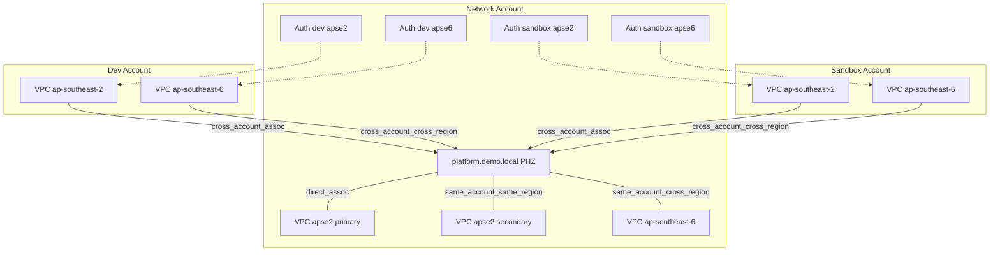

# Route 53 Multi-Account Multi-Region DNS Walkthrough

## Overview

This walkthrough demonstrates the **classic Route 53 private DNS sharing pattern** using VPC association authorization. A single private hosted zone (PHZ) in the **network** account serves as the authoritative DNS source; workload VPCs associate with that zone to resolve shared records.

The pattern uses `CreateVPCAssociationAuthorization` / `AssociateVPCWithHostedZone` — no Route 53 Profiles, AWS RAM, Transit Gateway, or orchestration scripts.

### Four association scenarios

| Scenario | Example stack | Authorization required? |
|----------|---------------|-------------------------|
| Cross-account, same region | `dev-apse2` | Yes |
| Cross-account, cross-region | `dev-apse6` | Yes (with correct `vpc_region`) |
| Same-account, cross-region | `network-apse6` | No |
| Same-account, same region (second VPC) | `network` secondary VPC | No |

### Accounts and regions

Three AWS accounts, two regions (`ap-southeast-2`, `ap-southeast-6`):

| Stack | Account | Region | CIDR |
|-------|---------|--------|------|
| `network` | network | ap-southeast-2 | 10.0.0.0/16 (primary) + 10.3.0.0/16 (secondary) |
| `network-apse6` | network | ap-southeast-6 | 10.10.0.0/16 |
| `dev-apse2` | dev | ap-southeast-2 | 10.1.0.0/16 |
| `dev-apse6` | dev | ap-southeast-6 | 10.11.0.0/16 |
| `sandbox-apse2` | sandbox | ap-southeast-2 | 10.2.0.0/16 |
| `sandbox-apse6` | sandbox | ap-southeast-6 | 10.12.0.0/16 |

DNS records (network PHZ only):

- `api.platform.demo.local` → `10.0.1.10`
- `db.platform.demo.local` → `10.0.1.20`

Deployment is manual and phased. DNS testing uses EC2 + SSM Session Manager + `dig` from **7 Test_EC2** instances (one per VPC).

### Why classic (and when not)

**Classic** means the native Route 53 APIs: the zone owner creates a **VPC_Association_Authorization** for a specific VPC ID and region; the VPC owner creates a **VPC_Association**. The contract is explicit, API-visible, and does not depend on Route 53 Profiles or AWS RAM.

**Why this demo uses classic:** it teaches the underlying sharing contract; one **Platform_Zone** in the **Network_Account** serves all regions; DNS records stay in one place; and presenters can narrate authorizations and associations as separate, auditable steps.

**When classic may not be best for production:** Route 53 Profiles centralise lifecycle management; classic auth binds to exact **Authorization_Specificity** (vpc_id + vpc_region) and breaks when a VPC is recreated; operations are two-party (network authorizes, workload associates); **Cross_Stack_Handoff** of outputs is manual.

**Stance:** classic fits this learning demo — not every greenfield design. See [Intentionally excluded](#intentionally-excluded) and [Limitations and lessons learned](#limitations-and-lessons-learned).

## Glossary

| Term | Meaning |
|------|---------|
| **Network_Account** | Owns the **Platform_Zone**, DNS records, and cross-account **VPC_Association_Authorization** resources |
| **Dev_Account** / **Sandbox_Account** | Workload accounts that create **VPC_Association** to the shared zone |
| **PHZ** | Private hosted zone — resolves only from associated VPCs |
| **Platform_Zone** | Shared PHZ `platform.demo.local` in Network_Account |
| **Demo_Domain** | Base domain (`demo.local`); all shared records live only in the Network_Account PHZ |
| **VPC_Association_Authorization** | Network_Account permits a specific VPC (id + region) to associate |
| **VPC_Association** | VPC-owning account links its VPC to an authorized PHZ |
| **Authorization_Specificity** | Each authorization binds to an exact vpc_id and vpc_region — recreated VPCs need re-authorization |
| **Cross_Stack_Handoff** | Manual passing of Phase 1 `vpc_id` outputs and Phase 2a `zone_id` into later stacks |
| **Regional_Service_Gap** | A region lacks a service needed for full verification (e.g. `ec2messages` SSM endpoint in ap-southeast-6) |
| **Feature_Flag** | Boolean variables (`enable_phz`, `enable_zone_association`, etc.) for phased deploy |
| **Test_EC2** | One minimal EC2 per stack (seven total) for in-VPC DNS checks via SSM |
| **SSM_VPC_Endpoints** | Interface endpoints for `ssm`, `ssmmessages`, `ec2messages` — Session Manager from private subnets |

## Architecture



## Intentionally excluded

The following were **deliberately omitted** to keep focus on classic PHZ VPC association sharing:

- **Route 53 Profiles** and **AWS RAM** — alternative sharing models
- **Resolver query logging**, **DNS Firewall**, **outbound resolver rules** — hybrid/enterprise DNS features
- **Alias records** (ALB/NLB), **DNSSEC**, **failover/latency routing** — production hardening not required for this demo
- **Second PHZ** or regional zone copies — split-brain risk; resilience comes from **multi-region VPC associations** on one zone, not duplicate zones

## Limitations and lessons learned

These are operational realities of the classic pattern in this demo — not bugs in Route 53 itself.

### Regional service gaps (ap-southeast-6)

AWS has launched **`ssm`** and **`ssmmessages`** interface endpoints in `ap-southeast-6`, but **not `ec2messages`** yet. Stacks default to the two available endpoints so `terraform apply` succeeds. **VPC_Association** and Route 53 resolution do **not** depend on SSM.

In the current deployment, SSM agents on `*-apse6` instances register (**Ping: Online**) and `dig` resolves shared records **without NAT** — verified July 2026. If interactive `aws ssm start-session` fails, use `aws ssm send-command` with document `AWS-RunShellScript`, enable **NAT** (`enable_nat_gateway = true`), or verify association with Step A below. See [Testing ap-southeast-6 without NAT](#testing-ap-southeast-6-without-nat-default--0).

### Authorization brittleness

**VPC_Association_Authorization** uses **Authorization_Specificity**: exact vpc_id and vpc_region. If a workload VPC is destroyed and recreated, Phase 3 returns `AccessDenied` until `network/terraform.tfvars` is updated and Phase 2a is re-applied.

### Two-party operations

Network_Account creates authorizations; Dev_Account and Sandbox_Account create associations — separate profiles, separate applies, fixed order (Phase 2a before Phase 3).

### Cross-stack coupling

Manual **Cross_Stack_Handoff**: four workload `vpc_id` values into `network`, then `zone_id` into five downstream stacks. Stale or mistyped IDs are the most common demo failure mode. Always use `terraform.tfvars` (or pass all `-var` flags) on every re-apply — never toggle only NAT or SSM flags.

### Teardown ordering

Route 53 blocks PHZ deletion while cross-account associations exist. Set **Feature_Flag** values to `false` and apply workload stacks before destroying `network`.

### Single zone owner

One **Platform_Zone** in Network_Account simplifies authority but concentrates DNS control in that account. Workload accounts resolve shared names; they do not author records locally.

### Verification limits

Step A (`aws route53 list-hosted-zones-by-vpc`) proves **VPC_Association** without shell access. After a new association, allow **1–2 minutes** for resolver propagation before expecting `dig` to answer inside the VPC.

### Provider and region maturity

`ap-southeast-6` requires AWS provider **6.53.0+**. Older lock files fail with `invalid AWS Region: ap-southeast-6`.

### AWS Console region picker

Route 53 hosted zones appear global; VPC and EC2 are regional. Switching services may reset the region picker — see [AWS Console: VPC region vs Route 53 global](#aws-console-vpc-region-vs-route-53-global).

## Prerequisites

1. **Three AWS accounts** — network, dev, and sandbox
2. **Both regions enabled** on each account (`ap-southeast-2` and `ap-southeast-6`)
3. **AWS CLI profiles** — one per account:
   - `r53demo-network`
   - `r53demo-dev`
   - `r53demo-sandbox`

   ```ini
   [profile r53demo-network]
   sso_session = my-sso
   sso_account_id = 111111111111
   sso_role_name = AdministratorAccess
   region = ap-southeast-2

   [profile r53demo-dev]
   sso_session = my-sso
   sso_account_id = 222222222222
   sso_role_name = AdministratorAccess
   region = ap-southeast-2

   [profile r53demo-sandbox]
   sso_session = my-sso
   sso_account_id = 333333333333
   sso_role_name = AdministratorAccess
   region = ap-southeast-2
   ```

4. **Terraform** >= 1.5.0
5. **AWS provider** pinned to **6.53.0** in each stack (`versions.tf`). After cloning or pulling updates, run `terraform -chdir=terraform/accounts/<stack> init -upgrade` once per stack.
6. **Optional** — copy `terraform.tfvars.example` → `terraform.tfvars` in each stack directory

### Phase-specific variables

| Variable | Where | When needed |
|----------|-------|-------------|
| `dev_apse2_vpc_id`, `dev_apse6_vpc_id`, `sandbox_apse2_vpc_id`, `sandbox_apse6_vpc_id` | `network` | Phase 2a — from workload Phase 1 outputs |
| `zone_id` | `network-apse6`, all workload stacks | Phase 2b / Phase 3 — from network Phase 2a output |

Run all commands from the **repository root**. Set `AWS_PROFILE` before each command. Verify with `aws sts get-caller-identity`.

Default tags: `Project=r53demo`, `Account=<network|dev|sandbox>`, `ManagedBy=terraform`.

### AWS Console: VPC region vs Route 53 global

VPCs and EC2 are **regional** (per stack `aws_region`). Route 53 hosted zones are **global** in the console.

Switching between Route 53 and VPC/EC2 may change the region picker (often to `us-east-1`). If lists look empty, switch back to the stack's region (`ap-southeast-2` or `ap-southeast-6`) before assuming deploy failed.

### SSM Session Manager prerequisites

This demo places **Test_EC2** instances in **private subnets** with **no public IP**. By default there is **no NAT gateway** (`enable_nat_gateway = false`). Session Manager uses one of two outbound paths:

| Path | Requirements | Used in this demo |
|------|----------------|-------------------|
| **VPC interface endpoints** (preferred) | All three endpoints in the **same region** as the instance | `ap-southeast-2` stacks (default) |
| **Internet egress** | NAT gateway (`enable_nat_gateway = true`), NAT instance, or public IP | Optional on `*-apse6` stacks only |

When using **VPC interface endpoints**, Session Manager requires **all three** — partial coverage is not enough:

| Service suffix | AWS service | Required |
|----------------|-------------|----------|
| `ssm` | Systems Manager API | Yes |
| `ssmmessages` | Session data channel | Yes |
| `ec2messages` | Agent ↔ service messaging | Yes |

The instance SSM agent must reach all three. Missing any one → agent does not register → `aws ssm start-session` returns **`TargetNotConnected`**.

**Route 53 DNS testing is separate.** PHZ association and `dig` resolution do not depend on SSM. You can prove `ap-southeast-6` associations without a shell on those instances.

### ap-southeast-6: SSM VPC endpoints

In **ap-southeast-6**, AWS has launched **`ssm`** and **`ssmmessages`** interface endpoints, but **not `ec2messages`** yet. The `*-apse6` stack defaults create only the two that exist so `terraform apply` succeeds:

| Variable | Default (`*-apse2`) | Default (`*-apse6`) | Purpose |
|----------|---------------------|---------------------|---------|
| `enable_ssm_vpc_endpoints` | `true` | `true` | Master toggle — keep `true` if you want SSM when the region is complete |
| `ssm_vpc_endpoint_services` | all three | `ssm`, `ssmmessages` only | Which endpoint services to create |

Do **not** set `enable_ssm_vpc_endpoints=false` expecting SSM to work — that removes endpoints entirely.

After apply, confirm:

```bash
terraform -chdir=terraform/accounts/dev-apse6 output ssm_vpc_endpoints_enabled
terraform -chdir=terraform/accounts/dev-apse6 output ssm_vpc_endpoint_services
# Expected today: true, ["ssm", "ssmmessages"]
```

When AWS adds `com.amazonaws.ap-southeast-6.ec2messages`, re-apply with all three (no NAT needed — same as `ap-southeast-2`). Use the same `terraform.tfvars` / phase flags as Phase 3:

```bash
terraform -chdir=terraform/accounts/dev-apse6 apply \
  -var-file=terraform/accounts/dev-apse6/terraform.tfvars \
  -var='ssm_vpc_endpoint_services=["ssm","ssmmessages","ec2messages"]'
```

Check whether a service exists before applying:

```bash
aws ec2 describe-vpc-endpoint-services \
  --service-names com.amazonaws.ap-southeast-6.ec2messages \
  --region ap-southeast-6 \
  --query 'ServiceDetails[0].ServiceName' \
  --output text
```

### ap-southeast-6: enable NAT gateway for SSM (optional)

Until **`ec2messages`** exists as a VPC interface endpoint in `ap-southeast-6`, Session Manager from private subnets needs **internet egress**. Set **`enable_nat_gateway = true`** on each `*-apse6` stack (`network-apse6`, `dev-apse6`, `sandbox-apse6`).

The VPC module creates one NAT gateway in the first availability zone (internet gateway, one public subnet, private route `0.0.0.0/0` → NAT). Default is **`false`** — no hourly NAT charge until you opt in.

**Approximate cost:** ~**USD 0.06/hour** per NAT gateway in Asia Pacific regions (~**USD 1.40/day** per stack). All three `*-apse6` stacks for one day ≈ **USD 4–5** plus negligible data for SSM/`dig`.

Add to **`terraform.tfvars`** (copy from `terraform.tfvars.example` after Phase 2b/3) or pass the full flag set at apply time. **Never re-apply with only `-var="enable_nat_gateway=true"`** — that omits `zone_id` and Terraform will destroy the Route 53 VPC association.

```bash
cp terraform/accounts/dev-apse6/terraform.tfvars.example terraform/accounts/dev-apse6/terraform.tfvars
# Edit terraform.tfvars: set enable_nat_gateway = true

terraform -chdir=terraform/accounts/dev-apse6 plan -var-file=terraform/accounts/dev-apse6/terraform.tfvars
# Confirm: 0 to destroy, only NAT/IGW/public subnet additions

terraform -chdir=terraform/accounts/dev-apse6 apply -var-file=terraform/accounts/dev-apse6/terraform.tfvars
```

Or pass every required variable explicitly:

```bash
terraform -chdir=terraform/accounts/dev-apse6 apply \
  -var="zone_id=Z070508012PUKYLKK75IM" \
  -var="enable_zone_association=true" \
  -var="enable_test_ec2=true" \
  -var="enable_nat_gateway=true"
```

Apply the same toggle on `network-apse6` and `sandbox-apse6` if you want SSM on all seven test instances. You can enable NAT on Phase 1 (VPC only) or re-apply later — existing EC2 instances pick up egress once the private route exists.

After apply, confirm:

```bash
terraform -chdir=terraform/accounts/dev-apse6 output nat_gateway_enabled
# Expected when enabled: true
```

With NAT enabled, SSM works **without** the missing `ec2messages` interface endpoint. You can keep the default `ssm` + `ssmmessages` endpoints (reduces NAT data for those APIs) or set `enable_ssm_vpc_endpoints=false` to rely on NAT only — not recommended if you plan to remove NAT later.

**Teardown:** set `enable_nat_gateway=false` (or remove from tfvars) and re-apply, or destroy the stack — NAT gateway hourly billing stops when the resource is deleted.

### ap-southeast-6: alternatives when SSM is unavailable

If you **do not** enable NAT, Session Manager from private subnets **will not work** in `ap-southeast-6` until **`ec2messages`** is available as a VPC endpoint. Options ordered by **cost** (cheapest first):

| Option | Approx. cost | What you get |
|--------|--------------|--------------|
| **1. Wait + re-apply** | **$0** | Preferred long-term. When AWS launches `ec2messages`, add it to `ssm_vpc_endpoint_services` and re-apply. SSM + `dig` from `*-apse6` instances with no NAT. |
| **2. Route 53 CLI verification** | **$0** | Prove association without SSM. Tests 3, 5, 7 Step A — `aws route53 list-hosted-zones-by-vpc`. Confirms cross-region / cross-account DNS sharing; does not run `dig` inside the VPC. |
| **3. Live `dig` from `ap-southeast-2` stacks** | **$0** | Tests 1, 2, 4, 6 use SSM today. Cross-account same-region (Tests 4, 6) still demonstrates workload resolution of the shared **Platform_Zone**. |
| **4. NAT gateway (`enable_nat_gateway=true`)** | **~USD 1.40/day per stack** + data | **Built into this demo's Terraform** on `*-apse6` stacks. Enables SSM + `dig` from private subnets before `ec2messages` exists. Tear down or set `false` when finished. |
| **5. NAT instance (`t4g.nano`)** | **~USD 3+/month** + small data | Self-managed alternative — not included in this demo's Terraform. |
| **6. Disable SSM endpoints** | $0 | **Does not help.** `enable_ssm_vpc_endpoints=false` without NAT guarantees SSM cannot connect. |

For most presenters, **(1)** or **(2)+(3)** is enough without spend; use **(4)** when you want full SSM/`dig` on `ap-southeast-6` during the walkthrough.

## Pre-flight (before each apply)

Before every `terraform apply` or `terraform destroy`:

1. Set the profile for the account you are working in
2. Confirm you are in the correct account with `aws sts get-caller-identity`
3. **Phase 2b / Phase 3 stacks:** use `terraform.tfvars` (from `terraform.tfvars.example`) or pass **`zone_id`** plus phase flags on every apply — including NAT or SSM toggles
4. Run from the **repository root** using `-chdir` (replace `<stack>` with the target stack, e.g. `dev-apse2`):

```bash
terraform -chdir=terraform/accounts/<stack> init
terraform -chdir=terraform/accounts/<stack> validate
terraform -chdir=terraform/accounts/<stack> plan    # optional but recommended for live demos
```

- `terraform -chdir=... init` — downloads providers and initializes the backend
- `terraform -chdir=... validate` — confirms HCL syntax and provider schema correctness
- `terraform -chdir=... plan` — previews the resource graph (recommended before applying in front of an audience)
- **Reject any plan that destroys existing VPCs, associations, or EC2** unless you are tearing down — module updates (SSM endpoints, NAT) must be **add/change only** on live stacks

---

## Phase 1 — All VPCs

### Why this phase runs first

The network account's `cross-account-auth` module creates a `VPCAssociationAuthorization` for each workload VPC. That resource requires the target VPC to already exist — Terraform needs the real `vpc_id` value, not a placeholder. Without the VPCs deployed first, network has nothing to authorize.

**In short:** workload VPCs must exist before network can authorize them in Phase 2a.

### Deployment flags

Every stack in Phase 1 deploys **VPC only** — no PHZ, no associations, no Test EC2:

| Stack | Flags |
|-------|-------|
| `network` | `enable_phz=false`, `enable_cross_account_auth=false`, `enable_test_ec2=false` |
| `network-apse6`, all workload stacks | `enable_zone_association=false`, `enable_test_ec2=false` |

### Step 1.1 — Deploy dev-apse2 VPC

```bash
export AWS_PROFILE=r53demo-dev
aws sts get-caller-identity

terraform -chdir=terraform/accounts/dev-apse2 init
terraform -chdir=terraform/accounts/dev-apse2 validate

terraform -chdir=terraform/accounts/dev-apse2 apply \
  -var="enable_zone_association=false" \
  -var="enable_test_ec2=false"

terraform -chdir=terraform/accounts/dev-apse2 output
```

Example Phase 1 output:

```text
test_ec2_instance_id = ""
vpc_id = "vpc-043eac7bacf56d818"
```

Record `vpc_id` — this is your `dev_apse2_vpc_id` for Phase 2a. `test_ec2_instance_id` is empty until Phase 3.

### Step 1.2 — Deploy dev-apse6 VPC

```bash
export AWS_PROFILE=r53demo-dev
aws sts get-caller-identity

terraform -chdir=terraform/accounts/dev-apse6 init
terraform -chdir=terraform/accounts/dev-apse6 validate

terraform -chdir=terraform/accounts/dev-apse6 apply \
  -var="enable_zone_association=false" \
  -var="enable_test_ec2=false"

terraform -chdir=terraform/accounts/dev-apse6 output
```

Example Phase 1 output:

```text
ssm_vpc_endpoints_enabled = true
ssm_vpc_endpoint_services = tolist([
  "ssm",
  "ssmmessages",
])
test_ec2_instance_id = ""
vpc_id = "vpc-0006cc5fe1927f473"
```

Record `vpc_id` — this is your `dev_apse6_vpc_id` for Phase 2a. SSM endpoints are enabled; `ec2messages` is omitted until AWS launches it in `ap-southeast-6` (see [ap-southeast-6: SSM VPC endpoints](#ap-southeast-6-ssm-vpc-endpoints)). To enable SSM before then, set `enable_nat_gateway=true` (see [enable NAT gateway for SSM](#ap-southeast-6-enable-nat-gateway-for-ssm-optional)).

### Step 1.3 — Deploy sandbox-apse2 VPC

```bash
export AWS_PROFILE=r53demo-sandbox
aws sts get-caller-identity

terraform -chdir=terraform/accounts/sandbox-apse2 init
terraform -chdir=terraform/accounts/sandbox-apse2 validate

terraform -chdir=terraform/accounts/sandbox-apse2 apply \
  -var="enable_zone_association=false" \
  -var="enable_test_ec2=false"

terraform -chdir=terraform/accounts/sandbox-apse2 output
```

Example Phase 1 output:

```text
test_ec2_instance_id = ""
vpc_id = "vpc-06d0b38ba3fc1d7bd"
```

Record `vpc_id` — this is your `sandbox_apse2_vpc_id` for Phase 2a.

### Step 1.4 — Deploy sandbox-apse6 VPC

```bash
export AWS_PROFILE=r53demo-sandbox
aws sts get-caller-identity

terraform -chdir=terraform/accounts/sandbox-apse6 init
terraform -chdir=terraform/accounts/sandbox-apse6 validate

terraform -chdir=terraform/accounts/sandbox-apse6 apply \
  -var="enable_zone_association=false" \
  -var="enable_test_ec2=false"

terraform -chdir=terraform/accounts/sandbox-apse6 output
```

Example Phase 1 output:

```text
ssm_vpc_endpoints_enabled = true
ssm_vpc_endpoint_services = tolist([
  "ssm",
  "ssmmessages",
])
test_ec2_instance_id = ""
vpc_id = "vpc-0c30af010875151c7"
```

Record `vpc_id` — this is your `sandbox_apse6_vpc_id` for Phase 2a.

### Step 1.5 — Deploy network-apse6 VPC

```bash
export AWS_PROFILE=r53demo-network
aws sts get-caller-identity

terraform -chdir=terraform/accounts/network-apse6 init
terraform -chdir=terraform/accounts/network-apse6 validate

terraform -chdir=terraform/accounts/network-apse6 apply \
  -var="enable_zone_association=false" \
  -var="enable_test_ec2=false"

terraform -chdir=terraform/accounts/network-apse6 output
```

Example Phase 1 output:

```text
ssm_vpc_endpoints_enabled = true
ssm_vpc_endpoint_services = tolist([
  "ssm",
  "ssmmessages",
])
test_ec2_instance_id = ""
vpc_id = "vpc-03ed35112a1ccc72f"
```

Record `vpc_id` for reference. This VPC is associated in Phase 2b (same account — no authorization needed).

### Step 1.6 — Deploy network VPCs (primary + secondary)

```bash
export AWS_PROFILE=r53demo-network
aws sts get-caller-identity

terraform -chdir=terraform/accounts/network init
terraform -chdir=terraform/accounts/network validate

terraform -chdir=terraform/accounts/network apply \
  -var="enable_phz=false" \
  -var="enable_cross_account_auth=false" \
  -var="enable_test_ec2=false"

terraform -chdir=terraform/accounts/network output
```

Example Phase 1 output:

```text
test_ec2_instance_id_primary = ""
test_ec2_instance_id_secondary = ""
vpc_id_primary = "vpc-09f79f7011847f0cf"
vpc_id_secondary = "vpc-001e958b1d6e4df71"
zone_id = ""
```

Both VPCs are created in `ap-southeast-2`. The PHZ and associations are created in Phase 2a.

### Phase 1 — Capture outputs

Save all four workload VPC IDs for Phase 2a. Add them to `terraform/accounts/network/terraform.tfvars`:

```hcl
dev_apse2_vpc_id     = "vpc-043eac7bacf56d818"
dev_apse6_vpc_id     = "vpc-0006cc5fe1927f473"
sandbox_apse2_vpc_id = "vpc-06d0b38ba3fc1d7bd"
sandbox_apse6_vpc_id = "vpc-0c30af010875151c7"
```

Alternatively, pass them as `-var` flags in Phase 2a.

#### Output reference (Phase 1)

| Output | Stack | Used in |
|--------|-------|---------|
| `vpc_id` | `dev-apse2` | Phase 2a — `dev_apse2_vpc_id` |
| `vpc_id` | `dev-apse6` | Phase 2a — `dev_apse6_vpc_id` |
| `vpc_id` | `sandbox-apse2` | Phase 2a — `sandbox_apse2_vpc_id` |
| `vpc_id` | `sandbox-apse6` | Phase 2a — `sandbox_apse6_vpc_id` |
| `vpc_id_primary` | `network` | Reference — PHZ owner VPC (Phase 2a) |
| `vpc_id_secondary` | `network` | Reference — same-account second VPC (Phase 2a) |
| `test_ec2_instance_id` | workload stacks | `""` until Phase 3 |

> **Authorization is per VPC ID and region.** If a workload VPC is destroyed and recreated later (new `vpc_id`), update `network/terraform.tfvars` and re-apply Phase 2a before Phase 3.

---

### VPC association requirements (read before Phase 2a)

Cross-account sharing is a **two-step contract**: Network_Account authorizes a specific **VPC ID + region**, then the workload account associates. Same-account associations skip authorization.

Full prerequisites, IAM model, security boundaries, and best practices: [architecture.md — VPC association requirements](architecture.md#vpc-association-requirements).

## Phase 2a — Network PHZ and authorizations

### Why this phase runs second

Phase 2a must run before workload accounts can associate because Route 53 requires the **Platform_Zone** to exist and (for cross-account VPCs) a matching **VPC_Association_Authorization** per exact `vpc_id` and `vpc_region`. See [VPC association requirements](architecture.md#vpc-association-requirements) for the full checklist.

Phase 2a creates the PHZ, the same-account secondary VPC association, and all four cross-account authorizations in one apply.

### Set workload VPC IDs

Add the VPC IDs captured from Phase 1 to `terraform/accounts/network/terraform.tfvars`:

```hcl
dev_apse2_vpc_id     = "vpc-043eac7bacf56d818"
dev_apse6_vpc_id     = "vpc-0006cc5fe1927f473"
sandbox_apse2_vpc_id = "vpc-06d0b38ba3fc1d7bd"
sandbox_apse6_vpc_id = "vpc-0c30af010875151c7"
```

Or pass on the command line:

```bash
terraform -chdir=terraform/accounts/network apply \
  -var="dev_apse2_vpc_id=vpc-043eac7bacf56d818" \
  -var="dev_apse6_vpc_id=vpc-0006cc5fe1927f473" \
  -var="sandbox_apse2_vpc_id=vpc-06d0b38ba3fc1d7bd" \
  -var="sandbox_apse6_vpc_id=vpc-0c30af010875151c7"
```

### Step 2a.1 — Deploy network (PHZ + authorizations)

```bash
export AWS_PROFILE=r53demo-network
aws sts get-caller-identity

terraform -chdir=terraform/accounts/network init
terraform -chdir=terraform/accounts/network validate

terraform -chdir=terraform/accounts/network apply

terraform -chdir=terraform/accounts/network output
```

Example Phase 2a output:

```text
test_ec2_instance_id_primary = "i-0b90a3278525cabbc"
test_ec2_instance_id_secondary = "i-07515303ca0d6a107"
vpc_id_primary = "vpc-09f79f7011847f0cf"
vpc_id_secondary = "vpc-001e958b1d6e4df71"
zone_id = "Z070508012PUKYLKK75IM"
```

This apply creates:

- The primary VPC association via the PHZ `vpc` block (`10.0.0.0/16`)
- The `platform.demo.local` private hosted zone with A records (`api` → `10.0.1.10`, `db` → `10.0.1.20`)
- Same-account association for the secondary VPC (`10.3.0.0/16`) — **no authorization**
- VPC association **authorizations** for all four workload VPCs (dev/sandbox × apse2/apse6)
- Two Test EC2 instances (primary + secondary) in `ap-southeast-2`

> **Console tip:** The PHZ appears under **Route 53** (global). VPCs and EC2 are in **`ap-southeast-2`** — see [AWS Console: VPC region vs Route 53 global](#aws-console-vpc-region-vs-route-53-global) if the VPC console looks empty after checking Route 53.

### Phase 2a — Capture outputs

Record `zone_id` for Phase 2b and Phase 3:

```hcl
zone_id = "Z070508012PUKYLKK75IM"
```

Set this in `terraform/accounts/network-apse6/terraform.tfvars` and each workload stack's `terraform.tfvars`, or pass as `-var` during later applies.

#### Output reference (Phase 2a — network)

| Output | Used in |
|--------|---------|
| `zone_id` | Phase 2b (`network-apse6`) and Phase 3 (all workload stacks) |
| `vpc_id_primary` | Reference — direct PHZ association |
| `vpc_id_secondary` | Reference — same-account same-region association |
| `test_ec2_instance_id_primary` | DNS testing — baseline scenario |
| `test_ec2_instance_id_secondary` | DNS testing — same-account same-region scenario |

---

## Phase 2b — Network ap-southeast-6 (same-account cross-region)

### Why this is a separate step

Associating a VPC in **another region** within the **same account** does not require `VPCAssociationAuthorization`. Only `zone_id` is needed. This step demonstrates same-account cross-region sharing separately from cross-account flows.

### Set zone ID

Add the `zone_id` from Phase 2a to `terraform/accounts/network-apse6/terraform.tfvars` (copy from `terraform.tfvars.example`):

```hcl
zone_id                   = "Z070508012PUKYLKK75IM"
enable_zone_association   = true
enable_test_ec2           = true
```

### Step 2b.1 — Deploy network-apse6 (association + Test EC2)

```bash
export AWS_PROFILE=r53demo-network
aws sts get-caller-identity

terraform -chdir=terraform/accounts/network-apse6 init
terraform -chdir=terraform/accounts/network-apse6 validate

terraform -chdir=terraform/accounts/network-apse6 apply \
  -var-file=terraform/accounts/network-apse6/terraform.tfvars

terraform -chdir=terraform/accounts/network-apse6 output
```

Example output:

```text
test_ec2_instance_id = "i-05c251fd04fbc5d15"
vpc_id = "vpc-03ed35112a1ccc72f"
```

This apply creates:

- The VPC association between the `ap-southeast-6` VPC and the network `platform.demo.local` PHZ
- A Test EC2 instance (SSM-enabled) in `ap-southeast-6` for DNS testing

---

## Phase 3 — Workload associations and Test EC2

### Why this phase runs third

VPC associations require the authorization from Phase 2a to already exist. Route 53 enforces this — calling `AssociateVPCWithHostedZone` without a matching `VPCAssociationAuthorization` results in an immediate authorization error.

The Test EC2 instances in workload accounts need:

1. **The VPC** (deployed in Phase 1) — for networking and subnet placement
2. **The zone association** (created in this phase) — so `dig` queries resolve against the network PHZ

### Phase 3 deployment flags

All four workload stacks are applied with association and EC2 enabled:

| Flag | Value | Reason |
|------|-------|--------|
| `enable_zone_association` | `true` | Authorization exists; association can proceed |
| `enable_test_ec2` | `true` | VPC and association ready; EC2 can resolve DNS |

### Pre-flight: VPC ID must match network authorization

Before applying Phase 3, confirm each workload VPC ID still matches what network authorized in Phase 2a:

```bash
terraform -chdir=terraform/accounts/dev-apse2 output vpc_id
terraform -chdir=terraform/accounts/dev-apse6 output vpc_id
terraform -chdir=terraform/accounts/sandbox-apse2 output vpc_id
terraform -chdir=terraform/accounts/sandbox-apse6 output vpc_id

grep -E 'dev_apse|sandbox_apse' terraform/accounts/network/terraform.tfvars
```

If they differ, update `terraform/accounts/network/terraform.tfvars` and run `terraform -chdir=terraform/accounts/network apply` before continuing.

### Set zone ID on workload stacks

Add the `zone_id` from Phase 2a to each workload stack's `terraform.tfvars`:

```hcl
zone_id = "Z070508012PUKYLKK75IM"
```

### Step 3.1 — Deploy dev-apse2 (association + Test EC2)

```bash
export AWS_PROFILE=r53demo-dev
aws sts get-caller-identity

terraform -chdir=terraform/accounts/dev-apse2 init
terraform -chdir=terraform/accounts/dev-apse2 validate

terraform -chdir=terraform/accounts/dev-apse2 apply \
  -var="zone_id=Z070508012PUKYLKK75IM" \
  -var="enable_zone_association=true" \
  -var="enable_test_ec2=true"

terraform -chdir=terraform/accounts/dev-apse2 output
```

This apply creates:

- The VPC association between the dev `ap-southeast-2` VPC and the network `platform.demo.local` PHZ
- A Test EC2 instance (SSM-enabled) in the dev VPC for DNS testing

### Step 3.2 — Deploy dev-apse6 (association + Test EC2)

```bash
export AWS_PROFILE=r53demo-dev
aws sts get-caller-identity

terraform -chdir=terraform/accounts/dev-apse6 init
terraform -chdir=terraform/accounts/dev-apse6 validate

terraform -chdir=terraform/accounts/dev-apse6 apply \
  -var="zone_id=Z070508012PUKYLKK75IM" \
  -var="enable_zone_association=true" \
  -var="enable_test_ec2=true"

terraform -chdir=terraform/accounts/dev-apse6 output
```

This apply creates:

- The **cross-account cross-region** VPC association (`ap-southeast-6` VPC → network PHZ)
- A Test EC2 instance in the dev `ap-southeast-6` VPC

### Step 3.3 — Deploy sandbox-apse2 (association + Test EC2)

```bash
export AWS_PROFILE=r53demo-sandbox
aws sts get-caller-identity

terraform -chdir=terraform/accounts/sandbox-apse2 init
terraform -chdir=terraform/accounts/sandbox-apse2 validate

terraform -chdir=terraform/accounts/sandbox-apse2 apply \
  -var="zone_id=Z070508012PUKYLKK75IM" \
  -var="enable_zone_association=true" \
  -var="enable_test_ec2=true"

terraform -chdir=terraform/accounts/sandbox-apse2 output
```

This apply creates:

- The VPC association between the sandbox `ap-southeast-2` VPC and the network PHZ
- A Test EC2 instance in the sandbox `ap-southeast-2` VPC

### Step 3.4 — Deploy sandbox-apse6 (association + Test EC2)

```bash
export AWS_PROFILE=r53demo-sandbox
aws sts get-caller-identity

terraform -chdir=terraform/accounts/sandbox-apse6 init
terraform -chdir=terraform/accounts/sandbox-apse6 validate

terraform -chdir=terraform/accounts/sandbox-apse6 apply \
  -var="zone_id=Z070508012PUKYLKK75IM" \
  -var="enable_zone_association=true" \
  -var="enable_test_ec2=true"

terraform -chdir=terraform/accounts/sandbox-apse6 output
```

This apply creates:

- The **cross-account cross-region** VPC association (`ap-southeast-6` VPC → network PHZ)
- A Test EC2 instance in the sandbox `ap-southeast-6` VPC

### Phase 3 — Result

After Phase 3 completes, all seven Test EC2 instances are running:

| Account | Stack | Region | Scenario | VPC ID | Test EC2 |
|---------|-------|--------|----------|--------|----------|
| network | `network` | ap-southeast-2 | PHZ owner (primary) | `vpc-09f79f7011847f0cf` | `i-0b90a3278525cabbc` |
| network | `network` | ap-southeast-2 | Same-account same-region (secondary) | `vpc-001e958b1d6e4df71` | `i-07515303ca0d6a107` |
| network | `network-apse6` | ap-southeast-6 | Same-account cross-region | `vpc-03ed35112a1ccc72f` | `i-05c251fd04fbc5d15` |
| dev | `dev-apse2` | ap-southeast-2 | Cross-account same-region | `vpc-043eac7bacf56d818` | `i-0ce89349708d0f8e6` |
| dev | `dev-apse6` | ap-southeast-6 | Cross-account cross-region | `vpc-0006cc5fe1927f473` | `i-05376a08af6786a3b` |
| sandbox | `sandbox-apse2` | ap-southeast-2 | Cross-account same-region | `vpc-06d0b38ba3fc1d7bd` | `i-07203013a2225f48d` |
| sandbox | `sandbox-apse6` | ap-southeast-6 | Cross-account cross-region | `vpc-0c30af010875151c7` | `i-0f48e882121fdde54` |

**Platform_Zone:** `Z070508012PUKYLKK75IM` (`platform.demo.local`)

Proceed to DNS testing to verify resolution from each VPC.

---

## DNS testing

This is the demo payoff. Connect to each Test EC2 via SSM, run `dig`, and confirm the expected answer. Every instance should resolve `api.platform.demo.local` to `10.0.1.10` regardless of account or region.

See [SSM Session Manager prerequisites](#ssm-session-manager-prerequisites), [ap-southeast-6: enable NAT gateway for SSM (optional)](#ap-southeast-6-enable-nat-gateway-for-ssm-optional), and [ap-southeast-6: alternatives when SSM is unavailable](#ap-southeast-6-alternatives-when-ssm-is-unavailable) before Tests 3, 5, and 7.

**`ap-southeast-2` stacks (Tests 1, 2, 4, 6):** all three SSM endpoints exist — Session Manager works with no NAT.

**`ap-southeast-6` stacks (Tests 3, 5, 7):** Step A always works once **VPC_Association** exists. Step B (`dig` from the instance) works in the current deployment without NAT — SSM agent is **Online** with `ssm` + `ssmmessages` endpoints only. If `start-session` fails, use `send-command` (see [Optional: Run dig via SSM send-command](#optional-run-dig-via-ssm-send-command)) or enable [NAT gateway](#ap-southeast-6-enable-nat-gateway-for-ssm-optional).

### Testing ap-southeast-6 without NAT (default — $0)

NAT is **off by default** on `*-apse6` stacks. You can still complete the demo without paying for NAT:

| What you prove | How (no NAT) | Tests |
|----------------|--------------|-------|
| **PHZ shared to apse6 VPCs** | Step A — `aws route53 list-hosted-zones-by-vpc` from the **workload account** profile | 3, 5, 7 |
| **Cross-account authorizations exist** | Step A output lists `platform.demo.local` owned by network account | 5, 7 |
| **Live `dig` resolves shared records** | SSM + `dig` from **ap-southeast-2** instances (all three SSM endpoints exist there) | 1, 2, 4, 6 |
| **Cross-region + cross-account resolution** | Test 4 (dev apse2) and Test 6 (sandbox apse2) prove workload accounts resolve the network PHZ — same pattern as apse6, different region | 4, 6 |

**Sandbox apse6 (Test 7) without NAT — run Step A only:**

```bash
export AWS_PROFILE=r53demo-sandbox
aws route53 list-hosted-zones-by-vpc \
  --vpc-id vpc-0c30af010875151c7 \
  --vpc-region ap-southeast-6
```

**Expected:** `HostedZoneSummaries` includes `platform.demo.local` with `OwningAccount` = network account. That confirms Phase 2a authorization + Phase 3 association — the Route 53 sharing story for apse6.

**Optional — confirm authorizations from network account:**

```bash
export AWS_PROFILE=r53demo-network
aws route53 list-vpc-association-authorizations --id Z070508012PUKYLKK75IM \
  --query 'VPCAssociationAuthorizations[?VPCId==`vpc-0c30af010875151c7`]'
```

Then show live resolution on apse2 (Test 6) in the same sandbox account — audience sees `dig` → `10.0.1.10` without needing apse6 SSM.

**What you cannot do without NAT (until `ec2messages` exists):** If SSM agent does not register (**Ping: ConnectionLost**), Test 7 Step B will fail — use Step A, apse2 `dig` demos, or enable NAT.

If `dig` is not installed:

```bash
sudo dnf install -y bind-utils
```

### Test 1 — Network primary (baseline: PHZ owner)

Use `test_ec2_instance_id_primary` from `network` Phase 2a output.

```bash
export AWS_PROFILE=r53demo-network
aws ssm start-session --target i-0b90a3278525cabbc --region ap-southeast-2
```

Inside the session:

```bash
dig +short api.platform.demo.local
```

**Expected:** `10.0.1.10`

The primary VPC resolves via direct PHZ association (the zone's `vpc` block).

### Test 2 — Network secondary (same-account, same-region)

Use `test_ec2_instance_id_secondary` from `network` Phase 2a output.

```bash
export AWS_PROFILE=r53demo-network
aws ssm start-session --target i-07515303ca0d6a107 --region ap-southeast-2
```

```bash
dig +short api.platform.demo.local
```

**Expected:** `10.0.1.10`

Proves a second VPC in the same account and region resolves the shared zone without authorization.

### Test 3 — Network ap-southeast-6 (same-account, cross-region)

Use `test_ec2_instance_id` from `network-apse6` Phase 2b output (`i-05c251fd04fbc5d15`).

**Step A — Verify PHZ association:**

```bash
export AWS_PROFILE=r53demo-network
aws route53 list-hosted-zones-by-vpc \
  --vpc-id vpc-03ed35112a1ccc72f \
  --vpc-region ap-southeast-6
```

**Expected:** JSON listing `platform.demo.local` (zone `Z070508012PUKYLKK75IM`).

**Step B — SSM + `dig` (when all three endpoint services exist in the region):**

```bash
aws ssm start-session --target i-05c251fd04fbc5d15 --region ap-southeast-6
```

Inside the session:

```bash
dig +short api.platform.demo.local
```

**Expected:** `10.0.1.10`

If `start-session` returns **`TargetNotConnected`**, try [send-command](#optional-run-dig-via-ssm-send-command) or enable [NAT gateway](#ap-southeast-6-enable-nat-gateway-for-ssm-optional). After a new association, wait **1–2 minutes** before expecting `dig` to answer.

### Test 4 — Dev ap-southeast-2 (cross-account, same-region)

Use `test_ec2_instance_id` from `dev-apse2` Phase 3 output.

```bash
export AWS_PROFILE=r53demo-dev
aws ssm start-session --target i-0ce89349708d0f8e6 --region ap-southeast-2
```

```bash
dig +short api.platform.demo.local
```

**Expected:** `10.0.1.10`

### Test 5 — Dev ap-southeast-6 (cross-account, cross-region)

Use `test_ec2_instance_id` from `dev-apse6` Phase 3 output (`i-05376a08af6786a3b`).

**Step A — Verify PHZ association:**

```bash
export AWS_PROFILE=r53demo-dev
aws route53 list-hosted-zones-by-vpc \
  --vpc-id vpc-0006cc5fe1927f473 \
  --vpc-region ap-southeast-6
```

**Expected:** `platform.demo.local` listed (cross-account authorization + association from Phase 2a / Phase 3).

**Step B — SSM + `dig`:**

```bash
aws ssm start-session --target i-05376a08af6786a3b --region ap-southeast-6
```

```bash
dig +short api.platform.demo.local
```

**Expected:** `10.0.1.10` (verified without NAT in July 2026 deployment; enable NAT if SSM is unavailable)

### Test 6 — Sandbox ap-southeast-2 (cross-account, same-region)

Use `test_ec2_instance_id` from `sandbox-apse2` Phase 3 output.

```bash
export AWS_PROFILE=r53demo-sandbox
aws ssm start-session --target i-07203013a2225f48d --region ap-southeast-2
```

```bash
dig +short api.platform.demo.local
```

**Expected:** `10.0.1.10`

### Test 7 — Sandbox ap-southeast-6 (cross-account, cross-region)

Use `test_ec2_instance_id` from `sandbox-apse6` Phase 3 output (`i-0f48e882121fdde54`).

**Step A — Verify PHZ association:**

```bash
export AWS_PROFILE=r53demo-sandbox
aws route53 list-hosted-zones-by-vpc \
  --vpc-id vpc-0c30af010875151c7 \
  --vpc-region ap-southeast-6
```

**Expected:** `platform.demo.local` listed.

**Step B — SSM + `dig`:**

```bash
aws ssm start-session --target i-0f48e882121fdde54 --region ap-southeast-6
```

```bash
dig +short api.platform.demo.local
```

**Expected:** `10.0.1.10` (verified without NAT in July 2026 deployment; enable NAT if SSM is unavailable)

### Optional: query the DB record

From any connected Test EC2:

```bash
dig +short db.platform.demo.local
```

**Expected:** `10.0.1.20`

### Validation summary (live deployment)

All seven tests passed against the deployment documented above (July 2026):

| Test | Scenario | Step A (`list-hosted-zones-by-vpc`) | Step B (`dig api.platform.demo.local`) |
|------|----------|-------------------------------------|----------------------------------------|
| 1 | Network primary | n/a (direct PHZ) | `10.0.1.10` |
| 2 | Network secondary | n/a | `10.0.1.10` |
| 3 | Network apse6 | `platform.demo.local` listed | `10.0.1.10` |
| 4 | Dev apse2 | n/a | `10.0.1.10` |
| 5 | Dev apse6 | `platform.demo.local` listed | `10.0.1.10` |
| 6 | Sandbox apse2 | n/a | `10.0.1.10` |
| 7 | Sandbox apse6 | `platform.demo.local` listed | `10.0.1.10` |

Optional `dig db.platform.demo.local` → `10.0.1.20` from all instances that answered Test B.

> **Note:** Test 3 required re-creating a missing **VPC_Association** on `network-apse6` (Terraform state showed the association but AWS did not). After apply, allow 1–2 minutes for cross-region resolver propagation before Step B.

### Optional: Run dig via SSM send-command

When `start-session` is unavailable but the agent is **Online**, run `dig` non-interactively:

```bash
export AWS_PROFILE=r53demo-dev   # use the account that owns the instance
INSTANCE=i-05376a08af6786a3b
REGION=ap-southeast-6

CMD_ID=$(aws ssm send-command \
  --instance-ids "$INSTANCE" \
  --document-name "AWS-RunShellScript" \
  --parameters 'commands=["dig +short api.platform.demo.local","dig +short db.platform.demo.local"]' \
  --region "$REGION" \
  --query 'Command.CommandId' --output text)

sleep 8
aws ssm get-command-invocation \
  --command-id "$CMD_ID" --instance-id "$INSTANCE" --region "$REGION" \
  --query '{Status:Status,Stdout:StandardOutputContent}' --output json
```

**Expected stdout:** `10.0.1.10` then `10.0.1.20`.

---

## Troubleshooting

| Symptom | Likely cause | Resolution |
|---------|--------------|------------|
| `invalid AWS Region: ap-southeast-6` | Old AWS provider (v5.x lock file) | Run `terraform -chdir=terraform/accounts/<stack> init -upgrade`; stacks require provider **6.53.0** |
| `AccessDenied` on `AssociateVPCWithHostedZone` (403) | Stale VPC ID in `network/terraform.tfvars` | Compare workload `terraform -chdir=... output vpc_id` vs `terraform/accounts/network/terraform.tfvars`; update and re-apply Phase 2a |
| `AccessDenied` cross-region | Wrong `vpc_region` on authorization | Confirm Phase 2a authorizes apse6 VPCs with `ap-southeast-6` |
| `dig` returns no answer | Phase 3 incomplete | Confirm `enable_zone_association=true`; check PHZ associated VPCs in console |
| Wrong `zone_id` | Mismatch between stacks | Verify `zone_id` matches `terraform -chdir=terraform/accounts/network output zone_id` |
| Empty VPC console | Wrong region in console picker | Switch to `ap-southeast-2` or `ap-southeast-6` |
| Plan wants to **replace** `aws_route53_zone_association` | Re-apply without `zone_id` (defaults to empty) | Copy `terraform.tfvars.example` → `terraform.tfvars` with `zone_id` and phase flags; or pass `-var="zone_id=..."` — validation now blocks this |
| Plan wants to **create VPC** but VPC already exists in AWS | Lost or empty `terraform.tfstate` | **Do not apply.** Import existing resources or restore state from `terraform.tfstate.backup`; compare `terraform output vpc_id` with `network/terraform.tfvars` |
| Plan shows **destroy** on live stack | Missing `terraform.tfvars` or wrong phase flags | Use `-var-file=terraform.tfvars`; plan must show **0 to destroy** before apply |
| SSM session fails (`*-apse2` stacks) | VPC endpoints missing or security group blocks HTTPS (443) | Confirm `ssm_vpc_endpoints_enabled = true` and output lists `ssm`, `ssmmessages`, `ec2messages` |
| `InvalidServiceName` for `com.amazonaws.ap-southeast-6.ec2messages` | `ec2messages` interface endpoint not launched in `ap-southeast-6` yet | Omit from `ssm_vpc_endpoint_services` (default on `*-apse6` stacks); add when AWS launches the service |
| SSM `TargetNotConnected` (`*-apse6`) | Missing `ec2messages` endpoint or agent not registered | Try `aws ssm describe-instance-information` — if **Online**, use [send-command](#optional-run-dig-via-ssm-send-command); else enable [NAT gateway](#ap-southeast-6-enable-nat-gateway-for-ssm-optional) or Step A only |
| `dig` empty after new association | Route 53 resolver propagation delay | Wait 1–2 minutes; confirm PHZ appears in `list-hosted-zones-by-vpc` first |
| Step A missing `platform.demo.local` on network-apse6 | **VPC_Association** missing in AWS while Terraform state shows it | `terraform -chdir=terraform/accounts/network-apse6 plan -var-file=terraform.tfvars` — if plan wants to **create** association, apply with `-var-file` (1 add, 0 destroy) |
| Terraform state / AWS drift on association | Association deleted outside Terraform or failed mid-apply | Re-apply stack with full `terraform.tfvars`; never apply with partial `-var` flags |
| `dig` not found | `bind-utils` not installed | `sudo dnf install -y bind-utils` on Amazon Linux 2023 |

---

## Teardown

Destroy in **reverse dependency order**. Associations depend on authorizations, which depend on the PHZ — remove associations first, then network resources, then VPCs.

If you enabled **`enable_nat_gateway`** on `*-apse6` stacks, set it back to `false` and apply (or destroy the stack) to stop NAT hourly charges — see [enable NAT gateway for SSM](#ap-southeast-6-enable-nat-gateway-for-ssm-optional).

> Route 53 blocks PHZ deletion while cross-account associations exist. Complete Step 1 before destroying the network stack.

### Step 1 — Remove workload associations and EC2

Set flags to `false` and apply with `-var-file=terraform.tfvars` so `zone_id` is preserved. This removes associations and Test EC2 while **keeping VPCs**.

#### Step 1.1 — sandbox-apse6

```bash
export AWS_PROFILE=r53demo-sandbox

terraform -chdir=terraform/accounts/sandbox-apse6 apply \
  -var-file=terraform/accounts/sandbox-apse6/terraform.tfvars \
  -var="enable_zone_association=false" \
  -var="enable_test_ec2=false"
```

#### Step 1.2 — sandbox-apse2

```bash
export AWS_PROFILE=r53demo-sandbox

terraform -chdir=terraform/accounts/sandbox-apse2 apply \
  -var-file=terraform/accounts/sandbox-apse2/terraform.tfvars \
  -var="enable_zone_association=false" \
  -var="enable_test_ec2=false"
```

#### Step 1.3 — dev-apse6

```bash
export AWS_PROFILE=r53demo-dev

terraform -chdir=terraform/accounts/dev-apse6 apply \
  -var-file=terraform/accounts/dev-apse6/terraform.tfvars \
  -var="enable_zone_association=false" \
  -var="enable_test_ec2=false"
```

#### Step 1.4 — dev-apse2

```bash
export AWS_PROFILE=r53demo-dev

terraform -chdir=terraform/accounts/dev-apse2 apply \
  -var-file=terraform/accounts/dev-apse2/terraform.tfvars \
  -var="enable_zone_association=false" \
  -var="enable_test_ec2=false"
```

### Step 2 — Remove network-apse6 association and EC2

```bash
export AWS_PROFILE=r53demo-network

terraform -chdir=terraform/accounts/network-apse6 apply \
  -var-file=terraform/accounts/network-apse6/terraform.tfvars \
  -var="enable_zone_association=false" \
  -var="enable_test_ec2=false"
```

### Step 3 — Destroy network stack

With all cross-account associations removed:

```bash
export AWS_PROFILE=r53demo-network

terraform -chdir=terraform/accounts/network destroy
```

Destroys the PHZ, authorizations, both `ap-southeast-2` VPCs, and Test EC2 instances.

### Step 4 — Destroy remaining VPCs (optional)

If you want a full cleanup, destroy each Phase 1 stack:

```bash
export AWS_PROFILE=r53demo-network
terraform -chdir=terraform/accounts/network-apse6 destroy

export AWS_PROFILE=r53demo-dev
terraform -chdir=terraform/accounts/dev-apse6 destroy
terraform -chdir=terraform/accounts/dev-apse2 destroy

export AWS_PROFILE=r53demo-sandbox
terraform -chdir=terraform/accounts/sandbox-apse6 destroy
terraform -chdir=terraform/accounts/sandbox-apse2 destroy
```
